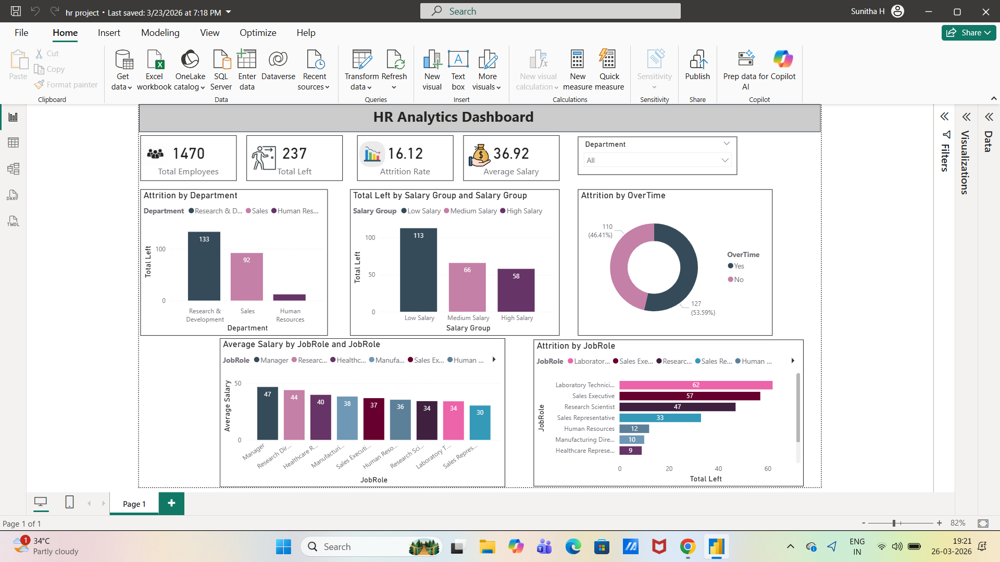

# HR-Analytics-dashboard
# HR Analytics Dashboard (Power BI)

## Project Overview
This project analyzes employee data to understand attrition patterns and workforce trends. The dashboard helps identify key factors such as department, salary, job role, and overtime that influence employee turnover, enabling better HR decision-making.

## Objectives
- Calculate overall employee attrition and key HR metrics  
- Identify departments with high employee turnover  
- Analyze the impact of salary levels on attrition  
- Understand how overtime affects employee retention  
- Examine attrition trends across different job roles  

## Tools & Technologies
- Power BI – Data visualization and dashboard creation  
- Microsoft Excel – Data cleaning and preprocessing  

## Dashboard Summary
## Key Metrics
- Total Employees: 1470  
- Total Attrition: 237  
- Attrition Rate: 16.12%  
- Average Salary: 36.92K  

## Visual Analysis
## 1. Attrition by Department
- Research & Development: 133 employees left  
- Sales: 92 employees left  
- Human Resources: Lowest attrition  

 R&D department has the highest employee turnover.

## 2. Attrition by Salary Group
- Low Salary: 113 employees  
- Medium Salary: 66 employees  
- High Salary: 58 employees  

 Employees in the low salary group have the highest attrition.

## 3. Attrition by Overtime
- Overtime (Yes): 127 employees (53.59%)  
- Overtime (No): 110 employees (46.41%)  

 Employees working overtime are more likely to leave.

## 4. Attrition by Job Role
- Laboratory Technician: Highest attrition (~62)  
- Sales Executive: High attrition (~57)  
- Research Scientist: Significant attrition (~47)  

 Certain job roles face consistently higher turnover.

## 5. Average Salary by Job Role
- Managers have the highest average salary (~47K)  
- Roles like Sales Representative and Human Resources have lower salaries  

 Higher salary roles show better employee retention.

##  Key Insights
- Attrition is highest in the Research & Development department.  
- Low salary is a major factor driving employee turnover.  
- Overtime significantly contributes to higher attrition.  
- Job roles like Laboratory Technician and Sales Executive face the most turnover.  
- Higher salary roles (like Managers) show better retention.  
- There is a strong relationship between low salary, overtime, and employee attrition.  

##  Conclusion
The analysis shows that salary, overtime, and job role are the main factors influencing employee attrition. Organizations can reduce attrition by improving compensation, managing workload, and focusing on high-risk job roles.

## 📁 Files Included
- hr project.pbix  
- dashboard screenshot.png

## 📷 Dashboard Preview

## 🔗 Project Links
- 📂 Download Dashboard: [PBIX File](hr_project.pbix)
- 📷 View Screenshot: [Click Here](dashboard_screenshot.png)
